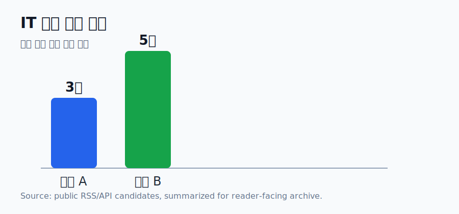

# 2026-05-26 IT 오늘의 핵심 보고서

공개 출처와 공식 발표를 바탕으로 오늘 확인할 흐름을 정리했습니다. 독자는 핵심 변화, 배경, 영향, 확인할 포인트를 한 번에 볼 수 있습니다.

## 리드
오늘 IT 흐름은 단순한 신기능 소개보다 AI·클라우드·개발도구가 실제 운영 통제와 보안 체계 안으로 들어오는 방향이 두드러집니다.
이번 묶음은 공개 검증 가능한 공식·전문 출처 후보를 기준으로 작성했습니다. 검색 RSS는 발견 경로였으므로 공개 인용 대상에서 제외했습니다.

## 한눈에 보는 차트


```text
등급 A: ███ 3건
등급 B: ███ 3건
```

## 핵심 사실
- 1. GitHub Copilot for Eclipse is open source — GitHub Blog Changelog / 등급 A / 품질 0.93
- 2. Issue fields are now in public preview for all organizations — GitHub Blog Changelog / 등급 A / 품질 0.93
- 3. Staged publishing and new install-time controls for npm — GitHub Blog Changelog / 등급 A / 품질 0.93
- 4. Announcing Claude Compliance API support with Cloudflare CASB — Cloudflare Blog / 등급 B / 품질 0.85
- 5. Project Glasswing: what Mythos showed us — Cloudflare Blog / 등급 B / 품질 0.85

## 배경과 맥락
특히 AI와 개발도구 이슈는 기능 출시보다 조직이 어떤 권한과 보안 정책으로 이를 관리할 수 있는지가 핵심입니다. 공급망 보안, IDE 확장, 클라우드 기반 에이전트 운영은 모두 개발 생산성과 통제 사이의 균형 문제로 연결됩니다.

## 본문 분석
### 1. GitHub Copilot for Eclipse is open source
출처: GitHub Blog Changelog / 등급 A / 발행·수집 시각: Thu, 21 May 2026 23:50:38 +0000
핵심 내용은 'Following our previous updates, GitHub Copilot for Eclipse is open source, with the code available on GitHub under the MIT license. This marks an important milestone for GitHub Copilot in… The post GitHub Copilot for Eclipse is open source appeared first on Th'입니다. 제목만 소비하기보다 출처와 맥락을 함께 보면 이 이슈가 실제로 어떤 변화와 연결되는지 더 분명해집니다.
분석적으로는 조직의 개발·보안·운영 프로세스에 어떤 통제 지점을 추가할 수 있는지가 관전 포인트입니다. 실제 적용 전에는 계정 권한, 지원 버전, 엔터프라이즈 정책 조건을 확인해야 합니다.
원문/후보 URL: [원문 보기](https://github.blog/changelog/2026-05-21-github-copilot-for-eclipse-is-open-source)

### 2. Issue fields are now in public preview for all organizations
출처: GitHub Blog Changelog / 등급 A / 발행·수집 시각: Thu, 21 May 2026 14:30:03 +0000
핵심 내용은 'Issue fields are now available in public preview to all GitHub organizations on github.com and GitHub Enterprise Cloud with data residency. When you define typed metadata like Priority, Effort, or… The post Issue fields are now in public preview for all organi'입니다. 제목만 소비하기보다 출처와 맥락을 함께 보면 이 이슈가 실제로 어떤 변화와 연결되는지 더 분명해집니다.
분석적으로는 조직의 개발·보안·운영 프로세스에 어떤 통제 지점을 추가할 수 있는지가 관전 포인트입니다. 실제 적용 전에는 계정 권한, 지원 버전, 엔터프라이즈 정책 조건을 확인해야 합니다.
원문/후보 URL: [원문 보기](https://github.blog/changelog/2026-05-21-issue-fields-are-now-in-public-preview-for-all-organizations)

### 3. Staged publishing and new install-time controls for npm
출처: GitHub Blog Changelog / 등급 A / 발행·수집 시각: Fri, 22 May 2026 18:27:12 +0000
핵심 내용은 'Today we’re shipping two updates focused on supply-chain security for npm: Staged publishing is generally available. New --allow-* install source flags (--allow-file, --allow-remote, --allow-directory) complement the existing --allow-git flag. Both… The post S'입니다. 제목만 소비하기보다 출처와 맥락을 함께 보면 이 이슈가 실제로 어떤 변화와 연결되는지 더 분명해집니다.
분석적으로는 조직의 개발·보안·운영 프로세스에 어떤 통제 지점을 추가할 수 있는지가 관전 포인트입니다. 실제 적용 전에는 계정 권한, 지원 버전, 엔터프라이즈 정책 조건을 확인해야 합니다.
원문/후보 URL: [원문 보기](https://github.blog/changelog/2026-05-22-staged-publishing-and-new-install-time-controls-for-npm)

### 4. Announcing Claude Compliance API support with Cloudflare CASB
출처: Cloudflare Blog / 등급 B / 발행·수집 시각: Thu, 21 May 2026 17:00:00 GMT
핵심 내용은 'Cloudflare now integrates with the Claude Compliance API, so that security teams can monitor Claude Enterprise activity directly in the Cloudflare Dashboard.'입니다. 제목만 소비하기보다 출처와 맥락을 함께 보면 이 이슈가 실제로 어떤 변화와 연결되는지 더 분명해집니다.
분석적으로는 조직의 개발·보안·운영 프로세스에 어떤 통제 지점을 추가할 수 있는지가 관전 포인트입니다. 실제 적용 전에는 계정 권한, 지원 버전, 엔터프라이즈 정책 조건을 확인해야 합니다.
원문/후보 URL: [원문 보기](https://blog.cloudflare.com/casb-anthropic-integration/)

### 5. Project Glasswing: what Mythos showed us
출처: Cloudflare Blog / 등급 B / 발행·수집 시각: Mon, 18 May 2026 06:00:00 GMT
핵심 내용은 'In recent weeks, we pointed Mythos and other security-focused LLMs at live code across critical parts of our infrastructure. We share what we observed, the models’ strengths and weaknesses, and what the work around them needs to look like before any of it can '입니다. 제목만 소비하기보다 출처와 맥락을 함께 보면 이 이슈가 실제로 어떤 변화와 연결되는지 더 분명해집니다.
분석적으로는 조직의 개발·보안·운영 프로세스에 어떤 통제 지점을 추가할 수 있는지가 관전 포인트입니다. 실제 적용 전에는 계정 권한, 지원 버전, 엔터프라이즈 정책 조건을 확인해야 합니다.
원문/후보 URL: [원문 보기](https://blog.cloudflare.com/cyber-frontier-models/)

### 6. Announcing Claude Managed Agents on Cloudflare
출처: Cloudflare Blog / 등급 B / 발행·수집 시각: Tue, 19 May 2026 13:00:00 GMT
핵심 내용은 'Cloudflare has integrated with Anthropic's Claude Managed Agents to provide a fast, isolated execution environment for autonomous code delivery. This means builders can scale agent workflows globally while strictly controlling access to private backends and ea'입니다. 제목만 소비하기보다 출처와 맥락을 함께 보면 이 이슈가 실제로 어떤 변화와 연결되는지 더 분명해집니다.
분석적으로는 조직의 개발·보안·운영 프로세스에 어떤 통제 지점을 추가할 수 있는지가 관전 포인트입니다. 실제 적용 전에는 계정 권한, 지원 버전, 엔터프라이즈 정책 조건을 확인해야 합니다.
원문/후보 URL: [원문 보기](https://blog.cloudflare.com/claude-managed-agents/)

## 함께 보면 좋은 시각자료
- diagram: AI·개발도구 운영통제 흐름도 — 수집된 IT 항목을 보안·개발도구·운영관리로 묶어 전체 흐름을 보여줍니다. / 캡션: IT 보고서 보조 시각자료: AI·개발도구 운영통제 흐름도
- table: 공급망 보안/AI 운영 이슈 비교표 — npm, Copilot, Cloudflare/Claude 관련 항목을 적용 대상과 확인 포인트별로 비교합니다. / 캡션: IT 보고서 보조 시각자료: 공급망 보안/AI 운영 이슈 비교표

## 읽을 때 유의할 점
- 빠르게 움직이는 이슈는 후속 발표와 원문 업데이트에 따라 해석이 달라질 수 있습니다.
- 사진은 저작권 문제가 없는 공식 이미지 또는 직접 제작한 차트·도식을 우선합니다.

## 다음 관전 포인트
- 공식 발표 원문 업데이트 여부
- 관련 기관·기업의 후속 조치
- 숫자 데이터가 확보될 경우 차트 고도화

## 출처
- GitHub Blog Changelog: [원문 보기](https://github.blog/changelog/2026-05-21-github-copilot-for-eclipse-is-open-source)
- GitHub Blog Changelog: [원문 보기](https://github.blog/changelog/2026-05-21-issue-fields-are-now-in-public-preview-for-all-organizations)
- GitHub Blog Changelog: [원문 보기](https://github.blog/changelog/2026-05-22-staged-publishing-and-new-install-time-controls-for-npm)
- Cloudflare Blog: [원문 보기](https://blog.cloudflare.com/casb-anthropic-integration/)
- Cloudflare Blog: [원문 보기](https://blog.cloudflare.com/cyber-frontier-models/)
- Cloudflare Blog: [원문 보기](https://blog.cloudflare.com/claude-managed-agents/)
---

## 이용 안내

이 문서는 공개 열람용 기사·보고서입니다. 원문 출처는 하단에 함께 제공합니다. 무단 복제, 사칭, 허위 제휴 표시는 금지됩니다.
